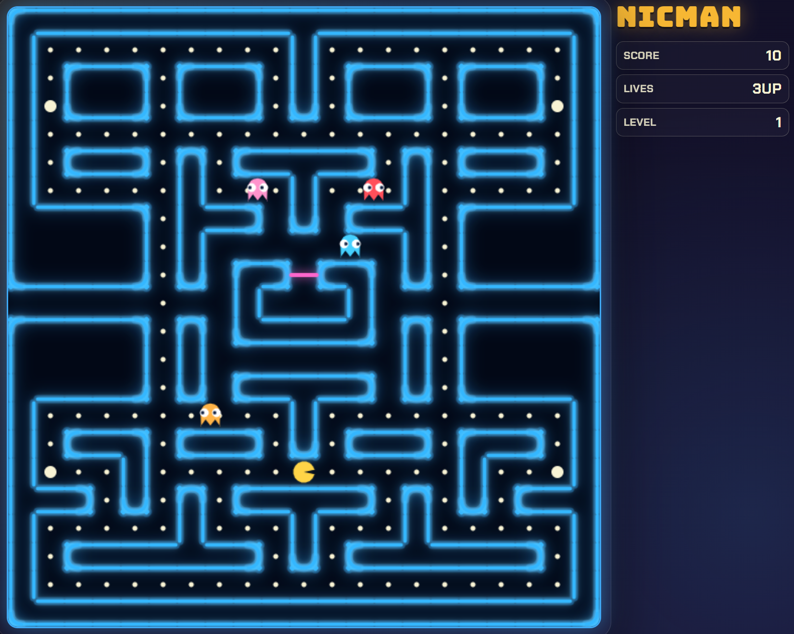

# Nicman

A lightweight browser implementation of Pacman&trade; built with plain HTML, CSS, and JavaScript.



## Features

- Grid-based maze with pellets and power pellets
- Giant mode via Power Apple pickups
- Four ghosts with chase and random behavior
- Score, lives, and level progression
- Keyboard controls: Arrow keys or numpad 8, 4, 2, 6
- Start and replay overlay

## Giant Mode

- A green Power Apple appears on a random walkable tile at intervals.
- Collecting it grants 1200 points and triggers Giant mode for about 10 seconds.
- In Giant mode, Pacman grows, moves faster, and can chomp ghosts for combo score.
- Ghost combo scoring starts at 300 and doubles on consecutive ghost captures.

## Quickstart

### Windows (fastest)

1. Double-click `launch.bat` from File Explorer, or run:

	```powershell
	.\launch.bat
	```

2. A local server starts on port 8080 and your browser opens `http://localhost:8080`.
3. To stop the server, close the `Nicman Server` terminal window.

### Optional direct file launch

If Python is unavailable or you prefer it, open `index.html` directly in your browser.

### Manual local server

1. Start a local server from this folder:

	```powershell
	python -m http.server 8080
	```

2. Open `http://localhost:8080` in your browser.

## Test Suite

Install dependencies:

```powershell
npm install
```

Run tests with coverage:

```powershell
npm test
```

Coverage thresholds are enforced at 80%+ for lines, statements, functions, and branches.
